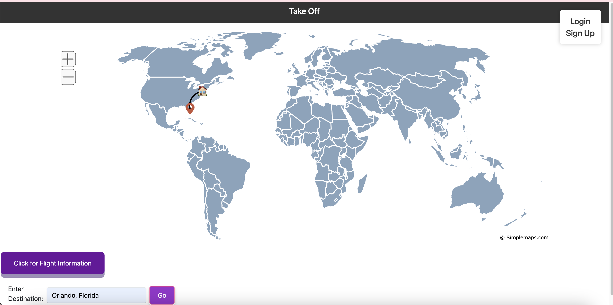
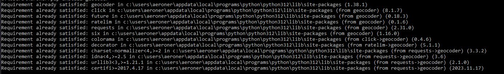
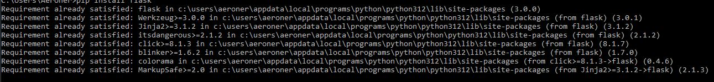
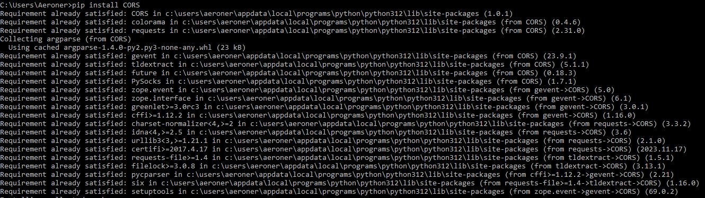
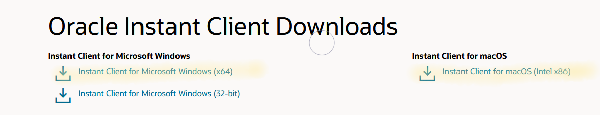
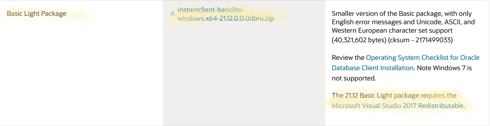
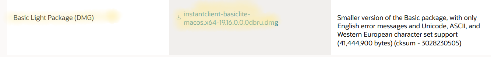
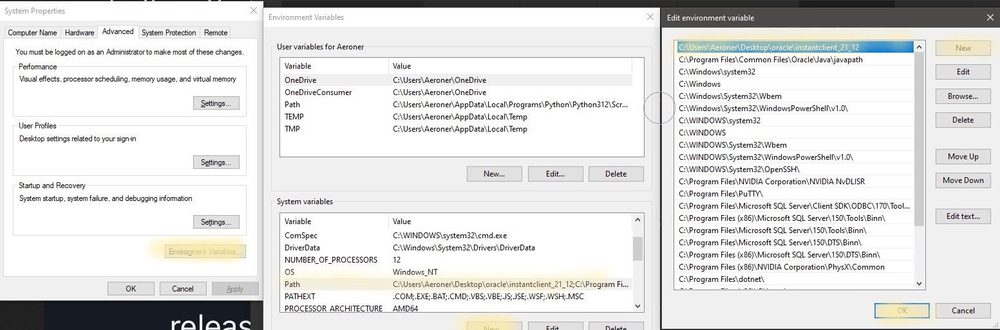
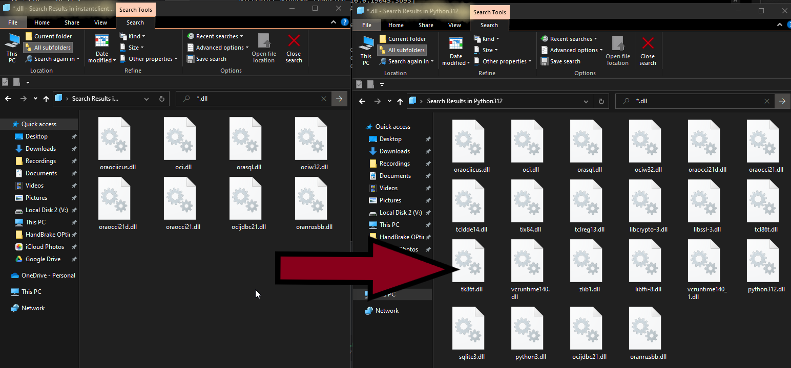
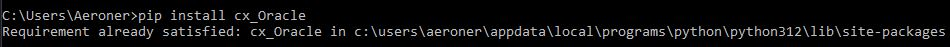

# TakeOff
Take Off is a web application project inspired by FlightRadar24. Users are able to view, search, bookmark, and track flights. Users will be able to filter the flights by location, duration, and distance. Users could sign up and/or login to save their account information and their history of tracked flights. Users could also zoom in and out of the map. HTML, CSS, and Javascript will be used for the frontend development. Python and Oracle SQL will be used for the backend. APIs such as Geolocation will be utilized to get one’s current location and AirLabs to find airport and flight information.

#### Homepage inspiration from [Flightradar24.com](https://flightradar24.com):

#### Our Mockup:

# How to run
To run our project you need to download three files:

    data.py

    login.py

    signup.py

After downloading these files, open up three terminals on your local machine.
In **each** terminal insert **ONE** of these commands

`start python data.py`

`start python login.py`

`start python signup.py`

After running all three commands in different terminals, launch the website by clicking this link [TakeOff-Web-App](https://cis3296f23.github.io/TakeOff-Web-App/) 

# How to contribute
Follow this project board to know the latest status of the project: [Project Board](https://github.com/orgs/cis3296f23/projects/130/views/1)

# How to build 
Currently, the most stable release of this project is the main branch.
This project has been thoroughly tested on python v3.12.0 and javascript (ECMAScript 2023).

This project makes use of multiple different libraries, packages and drivers all of which will be necessary to build.

### Geocoder
Firstly, we will need the 'geocoder' library which is a simple and consistent geocoding library written in Python. This is done simply using the 
`pip install geocoder` command.

To double check the success, rerun the commands and you should expect a similiar output:

### Flask

Secondly, we will need the flask and CORS libraries/modules. These modules are used for setting up the back-end servers and allow communication between the javascript oriented frontend and python oriented backend.

`pip install flask`
`pip install CORS`

To double check the success, rerun the commands and you should expect a similiar output:

## Database Modules / Drivers

Next, this project takes advantage of Temple's Oracle SQL database server. 

This is the most difficult part of the build process. You will need to manually download the Instant-Client for windows/macOS respectively.

This folder must be added to your PATH file path.

 
To ensure that the drivers are found by python, copy and paste the .dll files into the C:\User\Python\Python312 to ensure they are correctly found. 

### cx_Oracle

Due to Temple's Server being a bit deprecated, we will need to use cx_Oracle as opposed to the current, oracledb library. In addition to this, we must have Microsoft Visual C++ 14.0 or greater, only able to be downloaded using Visual-Studio-CPP-Build-Tools directly from their website using their installation/downloadable program.

After all this, you can sucessfully do 
`pip install cx_Oracle`

To double check the success, rerun the commands and you should expect a similiar output:

